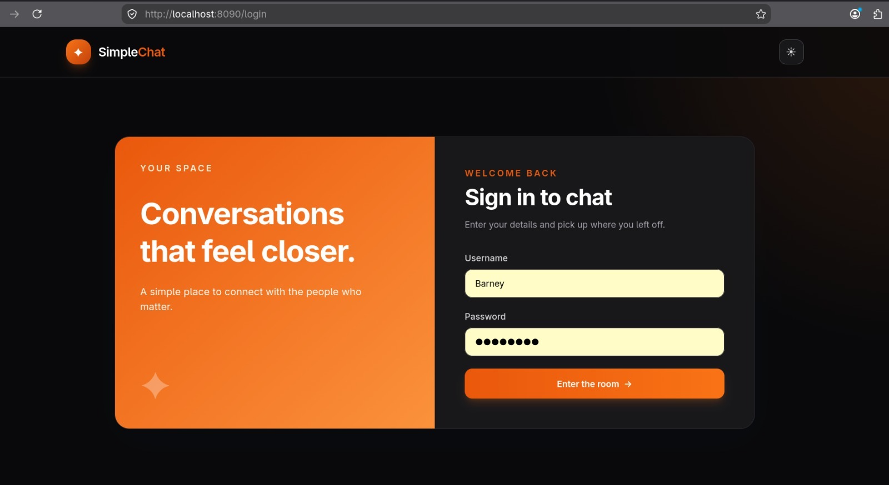
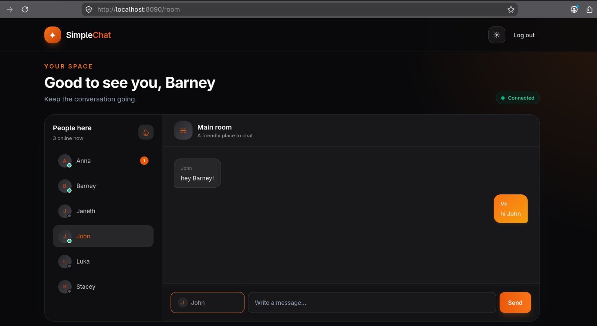
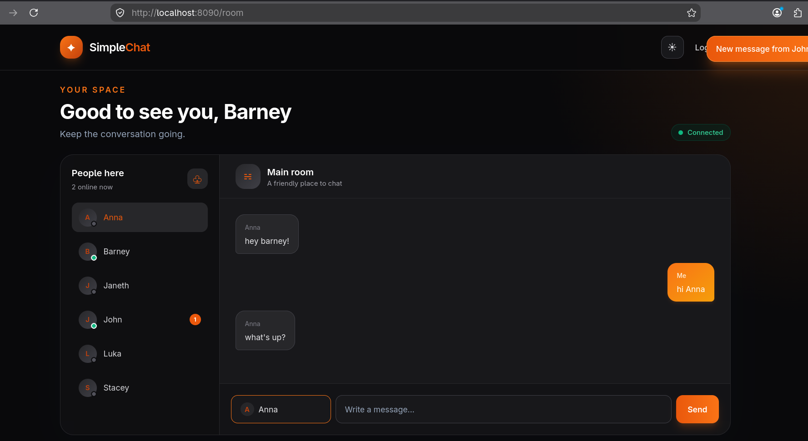
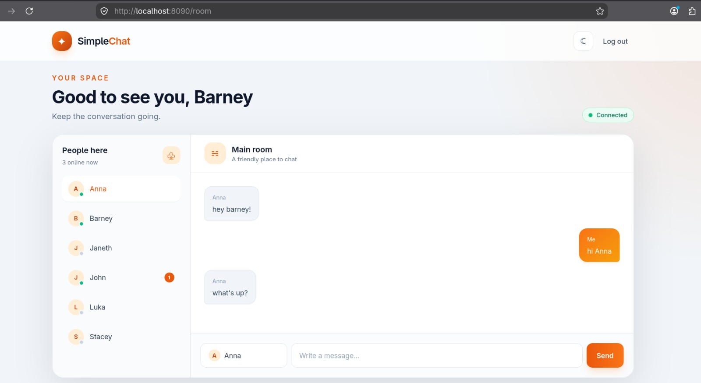

# Simple Chat Design Guidelines

This document describes the visual language used by Simple Chat. Keep new UI consistent with these guidelines unless a feature requires a deliberate design change.

## Screenshots

### Login

### Chat room — dark theme

### New message notification

### Chat room — light theme

Screenshots are stored in the [`screenshots/`](screenshots/) directory.

## Brand

- Product name: `SimpleChat`
- Logo symbol: `✦`
- Primary brand color: `#f97316` (`brand-500`)
- Primary action color: `#ea580c` (`brand-600`)
- Dark brand color: `#c2410c` (`brand-700`)
- Soft brand background: `#ffedd5` (`brand-100`)

Orange is used for primary actions, highlights, selected states, branding, and notifications.

## Themes

The application supports light and dark themes. The selected theme is stored in `localStorage` under `chat-theme`.

### Light theme

- Page background: Slate tones, primarily `slate-100`.
- Surface background: White.
- Secondary surface: `slate-50`.
- Main text: `slate-800` and `slate-900`.
- Muted text: `slate-500`.
- Borders: `slate-200`.

### Dark theme

- Page background: `zinc-950`.
- Surface background: `zinc-900`.
- Secondary surface: `zinc-950` with transparency.
- Main text: White or `zinc-100`.
- Muted text: `zinc-400`.
- Borders: `zinc-700` and `zinc-800`.

Green indicates online, connected, or active status. Red indicates an offline or failed connection.

## Typography

Use the default sans-serif system font. The project does not currently load a custom font.

- Headings should be bold, compact, and use tight letter spacing.
- Supporting text should use regular weight and muted colors.
- Small labels may use uppercase text with increased letter spacing.
- Buttons and important actions should use medium or semibold weight.

## Logo

The current logo is implemented with HTML text rather than an image asset:

- Orange rounded square with the `✦` symbol in white.
- `Simple` uses the main text color.
- `Chat` uses the primary brand color.

Keep the logo simple and text-based unless a dedicated logo asset is intentionally introduced.

## Components and layout

- Use rounded corners, generally `rounded-xl`, `rounded-2xl`, or `rounded-3xl`.
- Prefer subtle borders and soft shadows over heavy outlines.
- Use orange gradients for primary buttons and outgoing message bubbles.
- Use neutral surfaces for incoming messages and secondary controls.
- Keep primary actions visually prominent with white text and sufficient contrast.
- Preserve responsive behavior for desktop and mobile layouts.
- Keep the chat room layout organized around contacts, conversation content, and message composition.

## Notifications and status

- Toast notifications for incoming messages use a strong orange gradient with white text.
- Online and connected states use emerald/green indicators.
- Offline states use red indicators.
- Unread message counts use the primary brand color with white text.

## Implementation notes

The current interface uses Tailwind CSS classes directly in the templates. When adding or changing UI, prefer the existing color tokens and utility classes instead of introducing arbitrary colors.
