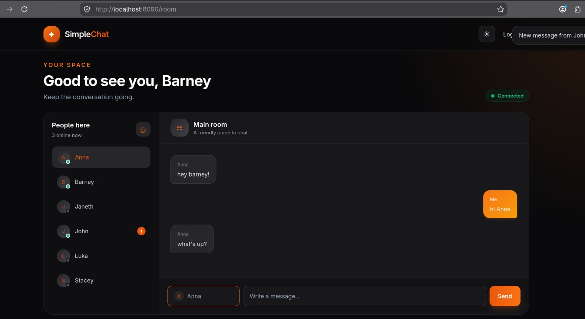

# Simple Chat

A small real-time chat application built with Go, PostgreSQL, HTTP handlers, HTML templates, and WebSockets.

## Features

- Username and password authentication.
- Cookie-based sessions.
- Real-time messaging through WebSockets.
- Online/offline contact presence.
- Private conversation history persisted in PostgreSQL.
- Dark and light UI themes.
- Docker Compose setup with PostgreSQL and Adminer.

## Screenshots

### Login


### Chat room — dark theme


### New message notification



### Chat room — light theme


Screenshots are stored in the [`screenshots/`](screenshots/) directory.

## Requirements

- Docker and Docker Compose, or
- Go 1.22+ and a PostgreSQL instance.

## Run with Docker Compose

Clone the repository and start the services:

```bash
git clone https://github.com/aabuezo/go-simple-chat.git
cd go-simple-chat
docker compose up -d
```

Open [http://localhost:8090/](http://localhost:8090/) in a browser.

Adminer is available at [http://localhost:8092/](http://localhost:8092/).

Use these connection values in Adminer:

| Field | Value |
| --- | --- |
| System | PostgreSQL |
| Server | `db` when connecting from the Compose network |
| Username | `postgres` |
| Password | `postgres` |
| Database | `chat` |

Stop the services with:

```bash
docker compose down
```

The PostgreSQL data is stored in the `db_data` Docker volume and is preserved when the services are stopped.

## Demo users

The application creates these users on first initialization:

`John`, `Barney`, `Anna`, `Janeth`, `Luka`, and `Stacey`

The default password for all demo users is:

```text
password
```

These credentials are intended for local development only.

## Project structure

```text
.
├── chat/                 # HTTP handlers, sessions, models, and WebSockets
├── config/               # Database initialization and shared configuration
├── templates/            # Login and chat room templates
├── main.go               # HTTP server and route registration
├── Dockerfile
├── docker-compose.yml
└── go.mod
```

## Useful commands

```bash
go test ./...
go vet ./...
go build ./...
gofmt -d .
```

## License

This project is provided for learning and educational purposes.

Use, modification, and redistribution are allowed only for personal,
educational, and non-commercial purposes. Commercial use is not
permitted without prior written permission from the copyright holder.

The software is provided "as is", without warranties or guarantees.
The author does not provide support or maintenance and is not
responsible for damages resulting from its use.

See the [LICENSE](LICENSE) file for the complete terms.
